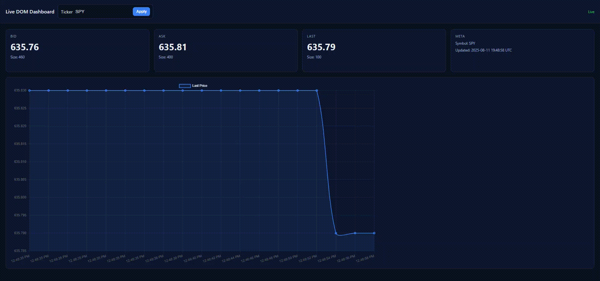
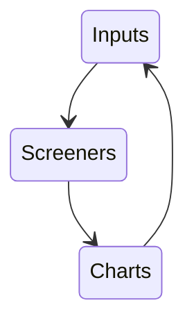
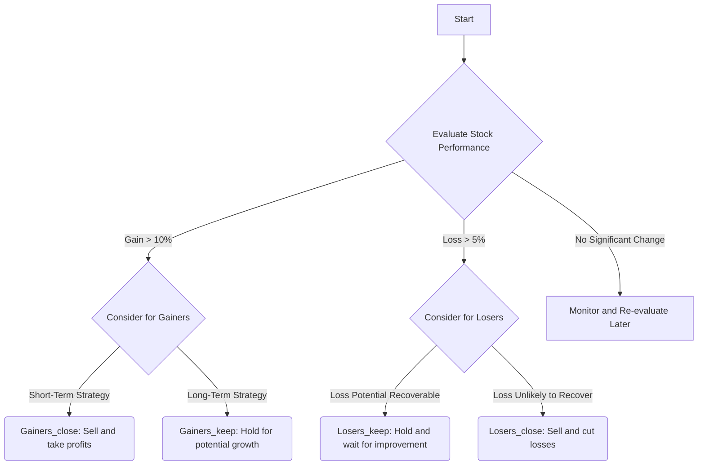

  

  
    
# Pecuniary Scripts Library

A collection of financial scripts to speed up batch processing input lists through screeners and visualizer output generators.  

 This repository is now maintained by Cursor and Cloudfare Agents 🤖.

⏰🧭🏁Major Update Notice - 8.11.25 - DOM Visualizer now available.

  

Checkout the DOM visualizer [here](https://github.com/Photon1c/PecuniaryScriptsLibrary/tree/main/scripts/dashboards)  
It uses CBOE's live Level II data from their direct page.

💻 Programmatically generate option payoff diagrams and heat maps with the new [AI Powered Option Eagle](scripts/ai_powered_option_eagle.py) 🦅 

⭐ Exhaustive script for LTSM Ensemble model released as a [notebook](scripts/refined_report_builders/lstm-ml-stock-predictions.ipynb) and [stand-alone script](scripts/refined_report_builders/LSTM-prediction-ensemble-chart-forecaster.py) now available.  

The sequence of steps that these scripts adhere to is as follows:

-Retrieve a list of stock tickers.  
-Iterate them through screening functions.  
-Update list with output from screening functions to generate charts.  

Check back later as material for this project is released.

Updates
  

# Update 3.22.2025  

New [AI Powered Option Eagle](scripts/ai_powered_option_eagle.py) 🦅 is useful to visualize multi-leg strategies and identify points of interests for stocks.  

# Update 3.18.25

Comprehensive HTML [Report Maker](scripts/refined_report_builders/fin-report-nasdaq.ipynb) for stock data using Nasdaq historical data. Sample outout can be viewed [here](https://cheddarbutler.com/work/financialreports/stockreports/spy_03182025_report/). Kaggle is recommended to handle datasets like this one.

# Update 3.12.25

A powerful [Long short-term memory (LSTM) script](scripts/refined_report_builders/LSTM-prediction-ensemble-chart-forecaster.py) that calculates an ensemble of statistical measures in order to generate a chart with predictive ranges is now available. It is still being debugged, but it's powerful enough to warrant being backed up and shared for posterity ☄️ Enjoy! The script is also in a [notebook](scripts/refined_report_builders/lstm-ml-stock-predictions.ipynb) that may be run with Kaggle, Google Collab, Jupyter Notebook, etc. The runtime suggested is a GPU for faster runtimes.   

# Update 3.3.2025 - 💹

A new tool, the [Metric Visualizer](/scripts/Financial-Metric-Visualizer.ipynb) is now available.  It computes the Sharpe Ratio, Annualized Return, and Volatility to then geneate a chart.

# Update 2.24.2025 - ✏️🗒📊

The [Tangency Portfolio Advanced Report Generator](/scripts/TangencyPortfolio-Advanced-Analysis.py) is now available.  

# Update 2.22.25 -💹👀📓

The [Option AI Payoff Diagram Generator](/inputs/OptionPayoff-AI-Creator.ipynb) is now available. Also, check out the [Stock Candle Wick Analyzers](https://github.com/Photon1c/StockCandleWickAnalyzers) repository for examples of the workflow mentioned on the 2.20.25 update.

# Update 2.20.2025 - 🧠🌠⏲️

The current project workflow is under development, check back for updates:

  
# Update 2.19.2025 - 💻👁️📊

The [Trading View - Chart Extractor](scripts/TradingView-ChartExtractor.ipynb) is a useful image saving script to collect stock charts that LLMs can use for vision analysis.  

# Advanced Screening Added 2.9.2025 ⚗️🔎  

A hypothetical portfolio that contains a given list of tickers may be sorted in the following manner so as to decide which positions to close and which to keep. This is for educational purposes only and is not financial advice, the concepts here are meant to build upon existing ones and branch on to new ones. The [following script](https://github.com/Photon1c/PecuniaryScriptsLibrary/blob/main/scripts/advanced_screener_portfolio_manager.py) uses the logic in the flow diagram below: 

