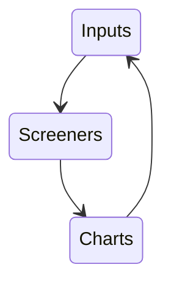
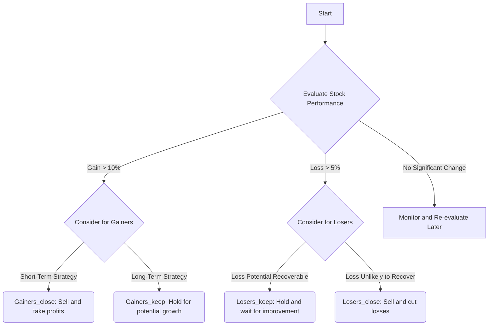

  

  
    
# Pecuniary Scripts Library

A collection of financial scripts to speed up batch processing input lists through screeners and visualizer output generators.

The sequence of steps that these scripts adhere to is as follows:

-Retrieve a list of stock tickers.  
-Iterate them through screening functions.  
-Update list with output from screening functions to generate charts.  

Check back later as material for this project is released.

  
# Update 2.19.2025 💻👁️📊

The [Trading View - Chart Extractor](scripts/TradingView-ChartExtractor.ipynb) is a useful image saving script to collect stock charts that LLMs can use for vision analysis.  

# Advanced Screening Added 2.9.2025 ⚗️🔎  

A hypothetical portfolio that contains a given list of tickers may be sorted in the following manner so as to decide which positions to close and which to keep. This is for educational purposes only and is not financial advice, the concepts here are meant to build upon existing ones and branch on to new ones. The [following script](https://github.com/Photon1c/PecuniaryScriptsLibrary/blob/main/scripts/advanced_screener_portfolio_manager.py) uses the logic in the flow diagram below: 

