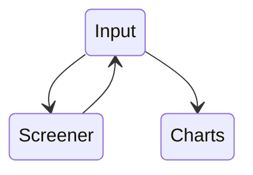

# Pecuniary Script Library

A collection of scripts to speed up the process of batch processing input lists through screeners and visualizer output generators.

The sequence of steps is as follows:

-Retrieve a list of stock tickers.  
-Iterate them through screening functions.  
-Update list with output from screening functions to generate charts.  

Check back later as material for this project is released.

