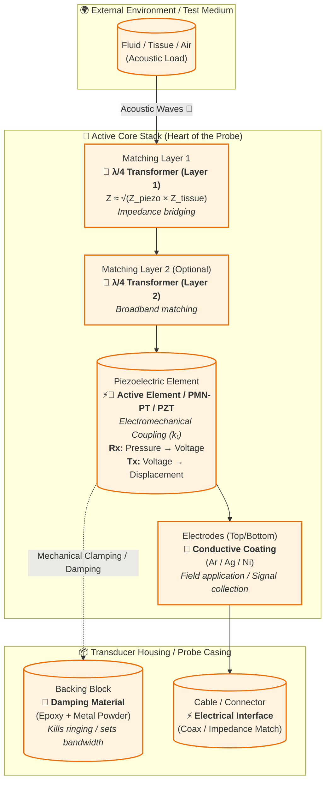
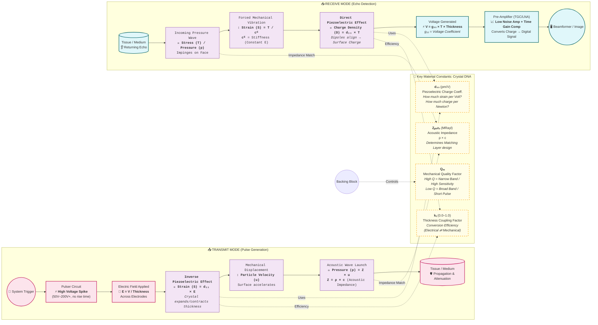

# Exploring Criticalities With Ultrasonic Transducers.

### 1. Anatomy & Component Mapping (The "Hardware" View)
*Shows the physical stack and maps friendly names to engineering terms.*

---

### 2. Operational Physics Flow (The "Mechanics" View)
*Shows the bidirectional energy conversion process (Tx ↔ Rx) with the physics equations simplified.*

---

### 💡 How to Read These Diagrams (Cheat Sheet)

| Friendly Term | Technical Term | Why it Matters |
| :--- | :--- | :--- |
| **"The Crystal"** | **Piezoelectric Element (PZT, PMN-PT, PMUT)** | The engine. Converts Voltage ⇄ Pressure. |
| **"Impedance Matching Stickers"** | **Quarter-Wave (λ/4) Matching Layers** | Gets sound *out* of the crystal into body (prevents echo at surface). |
| **"The Shock Absorber"** | **Backing Block (Damping)** | Stops the crystal ringing like a bell. **Trade-off:** More damping = Shorter pulse (Better Resolution) but Lower Sensitivity. |
| **"Squeeze Factor"** | **`d₃₃` (Piezoelectric Coefficient)** | Higher = More sensitive (Rx) & More displacement per volt (Tx). |
| **"Efficiency Score"** | **`kₜ` (Coupling Coefficient)** | **> 0.5 is good.** Theoretical max energy conversion. |
| **"Stiffness vs Mass"** | **Acoustic Impedance `Z = ρ × c`** | Determines how much sound reflects vs transmits at boundaries. |
| **"Ring-down Time"** | **`Qₘ` (Mechanical Q)** | **Low Q = Broadband (Imaging).** High Q = Narrowband (Therapy/Doppler). |
