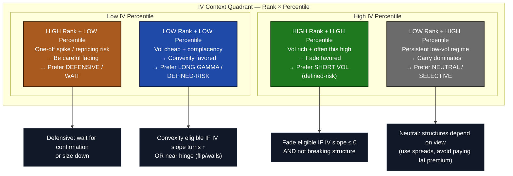
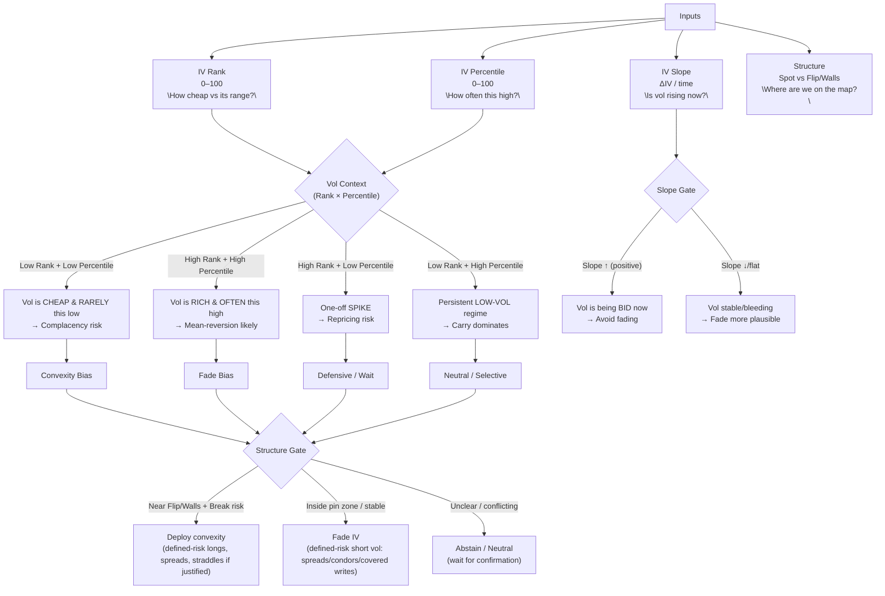

## IV Regime Trading Strategy

IV Rank & IV Percentile → Fade vs Convexity (One‑Page Study Sheet)
Quick definitions

IV Rank: where today’s IV sits between the 1Y low–high range (0–100).

IV Percentile: % of days in the lookback where IV was lower than today (0–100).

How to use them

Fade IV (short vol) = bet on mean reversion / vol coming down.

Deploy convexity (long vol) = bet on regime change / acceleration.

Mermaid overview diagram

## IV Rank × IV Percentile — Fade vs Convexity Matrix

| IV Rank | IV Percentile | Market Interpretation | Strategic Bias |
|--------:|--------------:|----------------------|----------------|
| **Low** | **Low** | Volatility is cheap and rarely this low (complacency regime) | **Deploy convexity** (long gamma, defined-risk longs) |
| **High** | **High** | Volatility is rich and often elevated (mean-reversion regime) | **Fade IV** (defined-risk short vol, carry structures) |
| **High** | **Low** | One-off volatility spike (possible repricing / regime shift) | **Defensive / wait** — fading is dangerous |
| **Low** | **High** | Persistent low-volatility environment (stable carry regime) | **Neutral / selective** — convexity delayed |

> **Rule of thumb:** Fade IV only when *both* Rank and Percentile are high and IV slope is not rising; deploy convexity when volatility is cheap or just beginning to reprice near structural levels.

