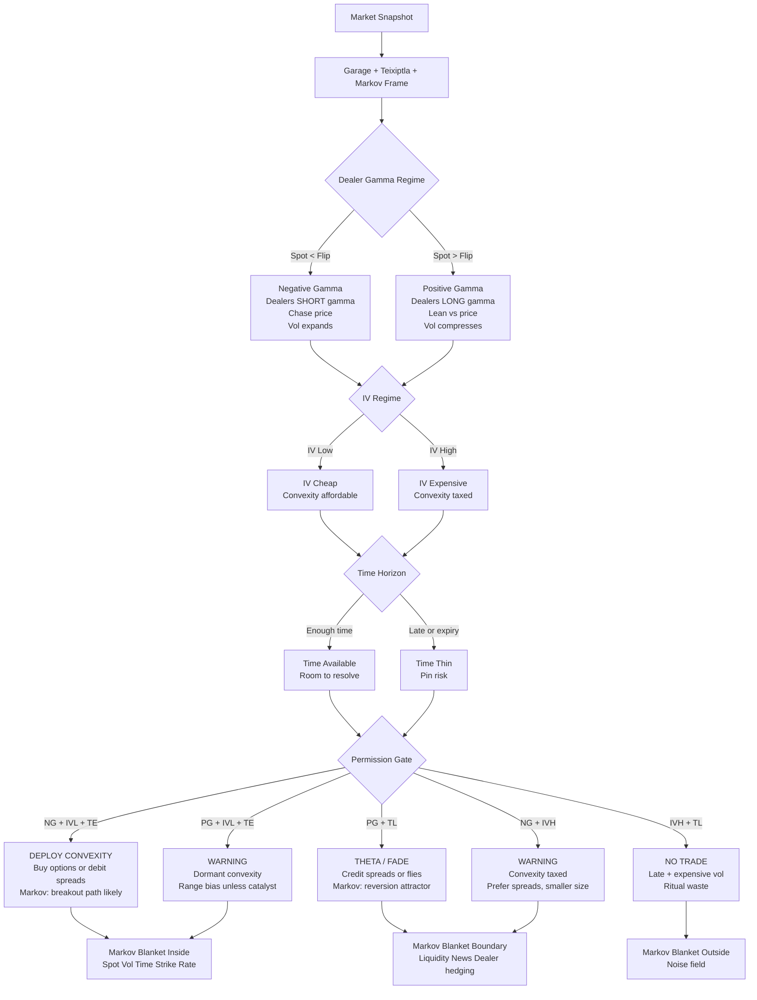
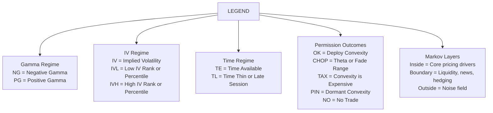

# The Teixiptla-Garage-Markov Framework

This document presents a regime-aware trading framework that blends gamma exposure dynamics, implied volatility structure, and a Markov causal perspective to help traders interpret options flow pressure and price behaviour. At its core is the idea that the market’s internal forces — particularly dealer hedging flows — create stability or instability regimes observable via tools like Barchart’s Gamma Exposure (GEX) charts. When price is below the gamma flip point, dealers are typically net short gamma, amplifying volatility and momentum; when above it, dealers are net long gamma, dampening volatility and encouraging range behaviour. By integrating this with IV rank/percentile and time horizon context, traders can derive a permission system that guides whether to deploy convexity (long options / debit spreads), theta-harvesting structures (credit spreads / flies), or to avoid trades altogether. This strategy uses a Markov Blanket analogy to distinguish core drivers (spot, vol, time), boundary conditions (liquidity, news, hedging), and noise — helping clarify when structural signals are meaningful versus when the market is dominated by randomness.

