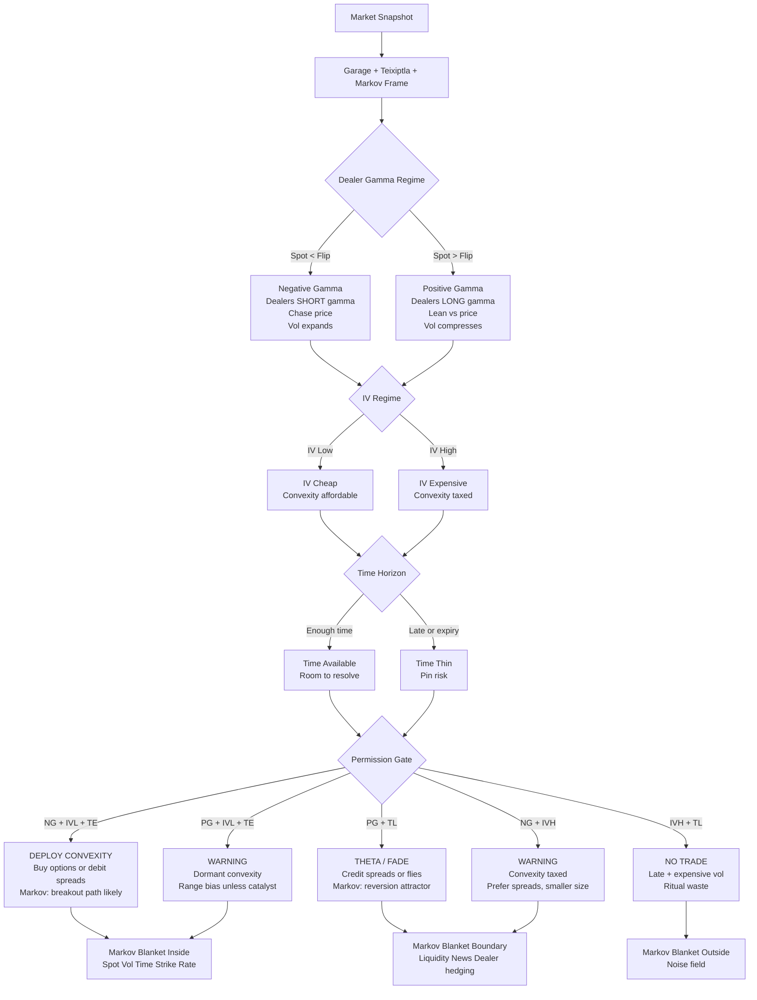
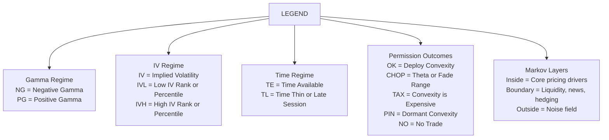

# The Teixiptla-Garage-Markov Framework

```mermaid
flowchart TB
  A[Market Snapshot] --> B[Garage + Teixiptla + Markov Frame]
  B --> C{Dealer Gamma Regime}

  C -->|Spot < Flip| NG[Negative Gamma\nDealers SHORT gamma\nChase price\nVol expands]
  C -->|Spot > Flip| PG[Positive Gamma\nDealers LONG gamma\nLean vs price\nVol compresses]

  NG --> D{IV Regime}
  PG --> D

  D -->|IV Low| IVL[IV Cheap\nConvexity affordable]
  D -->|IV High| IVH[IV Expensive\nConvexity taxed]

  IVL --> E{Time Horizon}
  IVH --> E

  E -->|Enough time| TE[Time Available\nRoom to resolve]
  E -->|Late or expiry| TL[Time Thin\nPin risk]

  TE --> F{Permission Gate}
  TL --> F

  F -->|NG + IVL + TE| OK[DEPLOY CONVEXITY\nBuy options or debit spreads\nMarkov: breakout path likely]
  F -->|PG + TL| CHOP[THETA / FADE\nCredit spreads or flies\nMarkov: reversion attractor]
  F -->|NG + IVH| TAX[WARNING\nConvexity taxed\nPrefer spreads, smaller size]
  F -->|PG + IVL + TE| PIN[WARNING\nDormant convexity\nRange bias unless catalyst]
  F -->|IVH + TL| NO[NO TRADE\nLate + expensive vol\nRitual waste]

  OK --> MB1[Markov Blanket Inside\nSpot Vol Time Strike Rate]
  CHOP --> MB2[Markov Blanket Boundary\nLiquidity News Dealer hedging]
  TAX --> MB2
  PIN --> MB1
  NO --> MB3[Markov Blanket Outside\nNoise field]

```

```mermaid
flowchart TB
  L[LEGEND]

  L --> G[Gamma Regime\nNG = Negative Gamma\nPG = Positive Gamma]

  L --> V[IV Regime\nIV = Implied Volatility\nIVL = Low IV Rank or Percentile\nIVH = High IV Rank or Percentile]

  L --> T[Time Regime\nTE = Time Available\nTL = Time Thin or Late Session]

  L --> P[Permission Outcomes\nOK = Deploy Convexity\nCHOP = Theta or Fade Range\nTAX = Convexity is Expensive\nPIN = Dormant Convexity\nNO = No Trade]

  L --> M[Markov Layers\nInside = Core pricing drivers\nBoundary = Liquidity, news, hedging\nOutside = Noise field]


```
