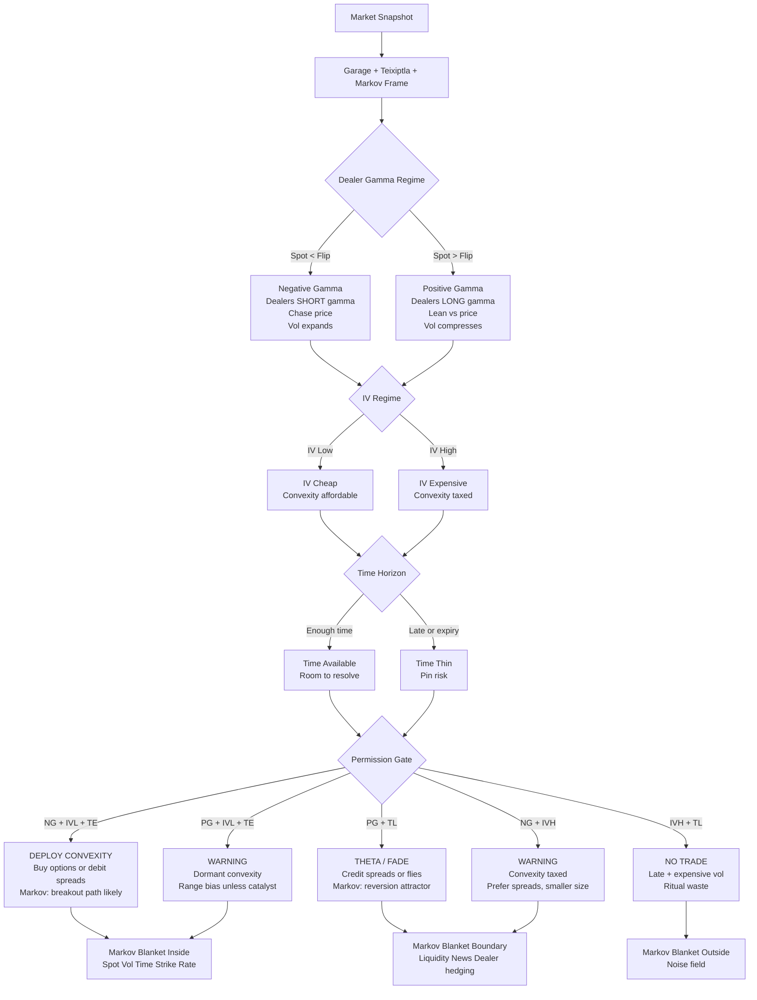
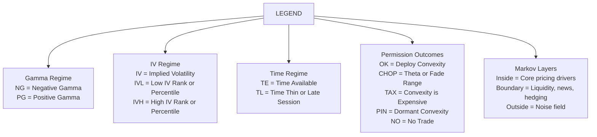

# The Teixiptla-Garage-Markov Framework

This document presents a regime-aware trading framework that blends gamma exposure dynamics, implied volatility structure, and a Markov causal perspective to help traders interpret options flow pressure and price behaviour. At its core is the idea that the market’s internal forces — particularly dealer hedging flows — create stability or instability regimes observable via tools like Barchart’s Gamma Exposure (GEX) charts. When price is below the gamma flip point, dealers are typically net short gamma, amplifying volatility and momentum; when above it, dealers are net long gamma, dampening volatility and encouraging range behaviour. By integrating this with IV rank/percentile and time horizon context, traders can derive a permission system that guides whether to deploy convexity (long options / debit spreads), theta-harvesting structures (credit spreads / flies), or to avoid trades altogether. This strategy uses a Markov Blanket analogy to distinguish core drivers (spot, vol, time), boundary conditions (liquidity, news, hedging), and noise — helping clarify when structural signals are meaningful versus when the market is dominated by randomness.

# Teixiptla Garage Probabilistic Model

| Teixiptla Garage Term      | Probabilistic Model                          |
|----------------------------|----------------------------------------------|
| Garage                     | Contained regime                             |
| Walls                      | High-OI constraints                          |
| Membrane                   | Gamma-neutral zone                           |
| Skin                       | Markov blanket boundary                      |
| Skin changes hands         | Markov blanket composition changes           |
| Release                    | Conditional independence structure collapses |

## IV Rank vs IV Percentile Interpretation

| IV Rank | IV Percentile | Interpretation                              | Bias              |
|---------|---------------|---------------------------------------------|-------------------|
| Low     | Low           | IV cheap and rarely this low (complacency)  | Convexity favored |
| High    | High          | IV rich and often this high (mean reversion)| Fade favored      |
| High    | Low           | One-off spike (possible repricing)           | Be careful fading |
| Low     | High          | Persistent low vol regime                   | Convexity delayed |

## Core Concepts

| Concept              | Meaning                          |
|----------------------|----------------------------------|
| Garage               | Long-gamma containment           |
| Walls                | High-OI gamma anchors            |
| Membrane             | Gamma neutrality zone            |
| Skin                 | Ownership of the membrane        |
| Ritual abstinence    | Inaction while membrane holds    |
| Bifurcation          | Membrane deformation             |
| Release              | Membrane rupture                 |

## Convexity vs Carry (Critical Contrast)

| Carry (short vol)          | Convexity (long vol)              |
|----------------------------|-----------------------------------|
| Sell options               | Buy options                       |
| Earn time decay            | Pay time decay                    |
| Works in ranges            | Works in breaks                   |
| Loses big on regime change | Loses small if nothing happens    |

## One-Glance Cheat Sheet

| Gamma | IV   | Time  | Permission      |
|-------|------|-------|-----------------|
| –     | Low  | Early | 🔥 Convexity    |
| –     | High | Any   | ⚠️ Careful      |
| +     | Low  | Late  | 🪤 Chop          |
| +     | High | Late  | 💀 No trade     |

Fading IV is selling insurance when people are scared but safe; deploying convexity is buying insurance when people are calm but wrong.

### Core Principle

Fading IV is a mean-reversion trade.  
Convexity is a regime-change trade.

## The Four Volatility Regimes (This is the Key Table)

| IV Rank | IV Percentile | Meaning                                  | Bias                |
|---------|---------------|------------------------------------------|---------------------|
| Low     | Low           | Vol is cheap and rarely this low         | Convexity favored   |
| High    | High          | Vol is expensive and often fades         | Fade favored        |
| High    | Low           | One-off spike                            | Be careful fading   |
| Low     | High          | Persistent low-vol regime                | Convexity delayed   |

### Fading IV is Safer When:
- IV Rank is high → you’re near historical extremes
- IV Percentile is high → this happens often enough to fade
- IV slope is flat or falling → market already supplying vol

*That’s the holy trinity for short vol.*

### Convexity is Justified When:
- IV Rank is low → vol is cheap
- IV Percentile is low → market is complacent
- IV slope turns positive → repricing has started

*This is where small premium buys can pay multiples.*

Use signals to find structure.  
Use Kelly to decide if the structure is tradable now.

# The “Anatomy” of the Profitable Trade, in 5 Teixiptla Steps

**Step 1 — Diagnose the ceremony (state)**  
You label the market moment, e.g.:  
- Pin / Chop: blanket tight, walls respected  
- Pre-transfer: pressure building near flip/wall  
- Transfer / Tear: boundary breaks; repricing; volatility regime change  

This is Markov blanket logic: what’s inside vs outside matters.

**Step 2 — Choose the correct skin for the ceremony (structure)**  
Different ceremonies demand different skins:  
- Pin: sell rich skin (short premium, defined risk)  
- Transfer: buy convex skin (debit spreads, long options)  
- Pre-transfer: probes, calendars, tight spreads  

This is the “structure” axis.

**Step 3 — Measure mispricing (cheap ask / expensive bid)**  
This is the heart of the “profitable anatomy.”  

A trade is “cheap entry ask” when at least one is true:  
- IV is low vs realized / expected future variance  
- Skew/term are misaligned with your scenario  
- Bid/ask is favorable (liquidity present)  
- You’re buying convexity when the market is pricing stasis  

A trade is “expensive exit bid” when:  
- IV has expanded (if you were long)  
- IV has crushed (if you were short)  
- Spot moved into the region that forces dealer hedging (walls/flip)  
- Spread/market depth improves at your exit point

**Step 4 — Kelly as the “Offering Gate” (permission sizing)**  
Here’s the key Teixiptla integration:  
Kelly should be computed conditional on the ceremony label:  
- If in Pin regime: Kelly is allowed to allocate to mean reversion structures.  
- If in Transfer regime: Kelly is allowed to allocate to convex structures.  
- If regime is uncertain: Kelly forces “PROBE” sizing.  

So Kelly isn’t one number. It’s:  

**Kelly(structure | regime | surface)**  

This is how it remains “within Teixiptla” rather than stapled onto it.

**Step 5 — The skin transfer (exit trigger)**  
Exit is literally: you sell the skin back when the crowd has re-priced it.  

Mechanically, you exit on:  
- Reaching a wall / flip interaction objective  
- IV move objective (crush/expansion captured)  
- Time decay becomes dominant vs remaining edge  
- Bid quality improves (you can actually get paid)

---

**The Logistics: Keep It Organized as a Diagram (no code yet)**  

To keep this from getting tangled again, adopt this anatomy table:  

**A) Ceremony Label (Teixiptla / Markov)**  
- pin / pre-transfer / transfer  

**B) Skin Selection (Garage structure)**  
- which structure fits that ceremony  

**C) Mispricing Test (cheap ask / expensive bid)**  
- IV level vs expected  
- skew shape  
- term shape  
- spread/liquidity  

**D) Kelly Gate (offering size)**  
- fraction = kelly(p,b) × mask_integrity × term_confidence × skew_risk  

**E) Transfer Rules (exit)**  
- where and why to transfer skin back  

---

**One Tight Story Example (so it “clicks”)**  

**Pin day near call wall, IV very low.**  
- Ceremony: mask stable (pin)  
- Skin: short premium but defined risk (iron condor / short call spread)  
- Cheap/expensive logic: you’re selling “overpriced calm” (premium rich relative to realized chops)  
- Kelly: allows moderate sizing only if pin metrics are stable and spreads are tight  
- Transfer: exit when spot re-pins and IV compresses further / time decay captured; sell-to-close at favorable bid  

**Transfer day crossing flip, skew steepening, IV term inverts.**  
- Ceremony: mask tearing (transfer)  
- Skin: long convexity (debit spreads / long options)  
- Cheap entry: options still priced for calm (IV lagging)  
- Kelly: shifts allocation away from short premium and into convex structures  
- Transfer: exit into IV expansion / wall chase when bids get fat  

---

**The one sentence that keeps us aligned**  

Teixiptla tells you what ritual is happening; Kelly tells you how much blood to spill.

