# The Neuroscience of Investing

🧠 The Gambler’s Brain (Outcome-Driven Loop)

In the gambler’s brain, market events trigger a surge of anticipation rather than careful evaluation. Losses, near-misses, or sudden price moves activate dopamine systems that push the brain to seek immediate emotional resolution. At the same time, stress and threat responses weaken rational control, making it harder to pause or stay neutral. The result is a powerful urge to “get it back” by acting again—often by trading larger, flipping direction, or re-entering too quickly. Being flat feels uncomfortable, not because of missed opportunity, but because the brain experiences the trade as unfinished. Decisions become driven by the need to relieve tension rather than by new information, leading to overtrading and escalating risk.

🧠 The Disciplined Trader’s Brain (Process-Driven Loop)

In the disciplined trader’s brain, market information is first filtered through rules, planning, and external structure rather than emotion. Signals of risk or uncertainty trigger a deliberate permission check: is a trade actually allowed under the model? Dopamine is released not for excitement or outcomes, but for following the process correctly—including staying flat or exiting early when conditions aren’t met. This makes inaction a stable and rewarding state instead of a source of anxiety. By outsourcing authority to a clear framework, the trader avoids impulsive reactions and only acts when structural conditions change. Decisions feel complete even without re-entry, because the brain is rewarded for informational closure, not emotional closure.

```mermaid
flowchart LR
    CUE["Market cue<br/>(price / P&L / news)"]

    PFC["dlPFC<br/>(rules & planning)"]
    ACC["ACC<br/>(conflict / error detection)"]
    INS["Insula<br/>(risk & uncertainty signal)"]
    MODEL["External model / playbook<br/>(Flight Envelope, Teixiptla, etc.)"]
    PERM["Permission check<br/>(“Is trade allowed?”)"]

    VTA["VTA<br/>(dopamine source)"]
    NACC["Nucleus accumbens<br/>(reward)"]
    DA_R["Dopamine tagged to process<br/>(rule-following, not outcome)"]

    ENTER["Enter trade<br/>(size & direction per plan)"]
    EXIT["Exit per rule<br/>(target / stop / time)"]
    FLAT["Stay flat<br/>(valid no-trade state)"]
    REVIEW["Post-trade review<br/>(update model & rules)"]

    %% Top-down control loop
    subgraph Control_Loop["Top-down control & permission"]
        CUE --> PFC
        CUE --> INS
        INS --> ACC

        PFC --> MODEL
        MODEL --> PFC

        PFC --> PERM
        ACC --> PERM
    end

    %% Permission branching
    PERM -->|No structural permission| FLAT
    PERM -->|Yes, conditions met| ENTER

    %% Trade lifecycle
    ENTER --> EXIT
    EXIT --> REVIEW
    FLAT --> REVIEW
    REVIEW --> MODEL

    %% Reward loop gated by rules
    subgraph Reward_Loop["Process-bound reward loop"]
        PERM --> VTA --> NACC --> DA_R
        EXIT --> VTA
        FLAT --> VTA
    end

    %% Classes
    classDef cool fill:#e5f0ff,stroke:#003399,stroke-width:1px;
    classDef hot fill:#ffe5e5,stroke:#cc0000,stroke-width:1px;
    classDef neutral fill:#f5f5f5,stroke:#555,stroke-width:1px;

    class PFC,ACC,MODEL,PERM cool;
    class INS,VTA,NACC,DA_R hot;
    class CUE,ENTER,EXIT,FLAT,REVIEW neutral;
```

Why This Matters

Most people don’t lose money in markets because they lack intelligence or information—they lose because their brains are wired to seek emotional relief under uncertainty. Without structure, the nervous system treats losses as unresolved threats and pushes users to act again, even when no new opportunity exists. This is how overtrading, revenge trades, and “getting caught in the middle” happen.

Understanding the difference between a gambler’s brain and a disciplined trader’s brain reframes discipline as architecture, not willpower. The goal isn’t to suppress emotion, but to design systems that prevent emotion from hijacking decision-making in the first place. By externalizing permission—through rules, models, or frameworks—users shift reward away from outcomes and toward correct process. Staying flat, exiting early, or doing nothing becomes a valid, even rewarding, decision.

In practice, this means better capital preservation, fewer impulsive errors, and clearer thinking under pressure. More importantly, it restores agency: instead of reacting to the market, the user operates within it deliberately. Markets are uncertain by nature—but the way decisions are made doesn’t have to be.

Works Cited

Kahneman, Daniel. Thinking, Fast and Slow. Farrar, Straus and Giroux, 2011.
— Foundational work distinguishing fast, emotion-driven decision systems from slow, rule-based reasoning; widely cited in behavioral finance.

Schultz, Wolfram. “Dopamine Reward Prediction Error Coding.” Dialogues in Clinical Neuroscience, vol. 18, no. 1, 2016, pp. 23–32.
— Establishes that dopamine responds to prediction errors and anticipation rather than outcomes, central to understanding gambling behavior.

Bechara, Antoine, et al. “Decision-Making and Addiction (Part I): Impaired Activation of Somatic States in Substance Dependent Individuals.” Neuropsychologia, vol. 40, no. 10, 2002, pp. 1675–1689.
— Demonstrates how emotional circuitry can override executive control under risk and uncertainty.

Lo, Andrew W., and Dmitry V. Repin. “The Psychophysiology of Real-Time Financial Risk Processing.” Journal of Cognitive Neuroscience, vol. 14, no. 3, 2002, pp. 323–339.
— Direct evidence that professional traders exhibit different physiological and neural responses to risk than novices.
